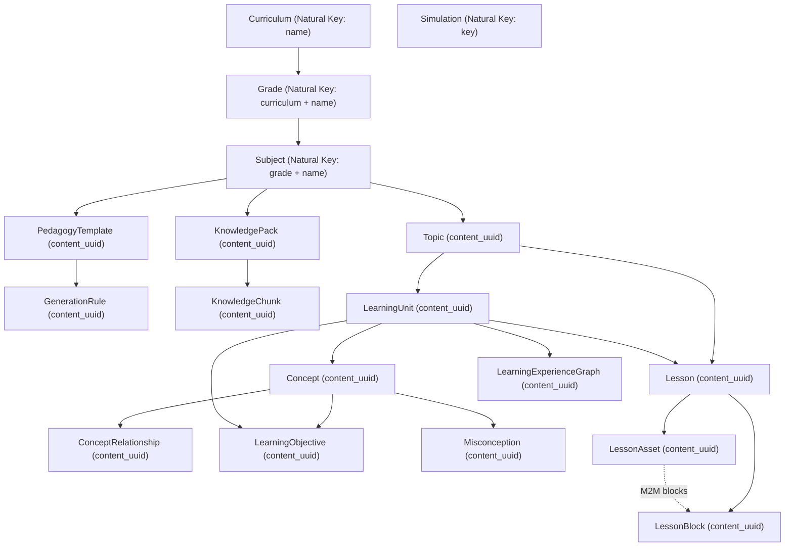

# VLearn Curriculum Publishing — Technical Architecture & Design

## 1. Executive Summary

This document describes the architectural design and implementation details of the VLearn Curriculum Publishing system. 

The publishing engine provides a safe, idempotent, one-way promotion pipeline from the local authoring database to the production Supabase PostgreSQL database while guaranteeing complete isolation of production operational data (users, payments, subscriptions, student progress, schools).

```
┌─────────────────────────────────────────────────────────┐
│              LOCAL POSTGRESQL (Authoring)               │
│  - Ingest, enrich, review, humanize curriculum          │
│  - Authorship and approval environment                  │
└────────────────────────────┬────────────────────────────┘
                             │
            python manage.py publish_curriculum
                             │
           ┌─────────────────┼─────────────────┐
           ▼                 ▼                 ▼
      --validate         --dry-run          --apply
     (Zero writes)     (Preview diff)    (Atomic write)
                             │
                             ▼
┌─────────────────────────────────────────────────────────┐
│            SUPABASE POSTGRESQL (Production)             │
│  - Real users, student progress, auth sessions          │
│  - Commercial subscriptions & Daraja M-Pesa ledger      │
│  - Promoted curriculum content updated in-place         │
└─────────────────────────────────────────────────────────┘
```

---

## 2. Dependency Hierarchy & Synchronization Graph

The curriculum domain contains 18 content models structured into a strict dependency hierarchy:



---

## 3. Stable Content Identity Strategy

Because database primary keys (`AutoField` / `BigAutoField`) are database-local auto-incrementing integers, integer IDs cannot serve as cross-database identifiers.

### Dual Identity Model

1. **Natural Key Models**: Models with unique structural invariants:
   - `Curriculum`: `name` (e.g. `'CBC'`)
   - `Grade`: `(curriculum.name, name)` (e.g. `('CBC', 'Grade 4')`)
   - `Subject`: `(grade.curriculum.name, grade.name, name)` (e.g. `('CBC', 'Grade 4', 'Mathematics')`)
   - `Simulation`: `key` (e.g. `'charles_law'`)

2. **UUID-Identified Models**: All other 14 curriculum content models receive permanent `content_uuid`:
   - `PedagogyTemplate`, `GenerationRule`, `KnowledgePack`, `KnowledgeChunk`, `Topic`, `LearningUnit`, `Concept`, `ConceptRelationship`, `LearningObjective`, `Misconception`, `Lesson`, `LessonBlock`, `LessonAsset`, `LearningExperienceGraph`.

### Migration Bridge vs. Future Identity

- **Migration Bridge (Initial Database Alignment)**: Existing rows in cloned databases receive deterministic UUIDs computed via `uuid.uuid5(VLEARN_NAMESPACE, f"{ModelName}:{pk}")`.
- **Future Content**: All new curriculum objects generated locally generate unique `uuid.uuid4()` instances upon creation.
- **Invariant**: Once assigned, `content_uuid` never changes and permanently identifies that curriculum entity across all environments.

---

## 4. Content Hashing & Change Detection

Change detection uses deterministic SHA-256 hashing (`content_hash`):

1. Introspect all concrete model fields excluding:
   - `id`, `pk`, `created_at`, `updated_at`, `content_uuid`, `content_hash`
   - Operational metadata fields (e.g. `Lesson.immutable_metadata`)
2. Serialize concrete fields in alphabetical field-name order:
   - For foreign keys: raw integer `field_id`
   - For JSON fields: `json.dumps(val, sort_keys=True)`
   - For scalar fields: `str(val)`
3. Compute SHA-256 digest of concatenated `field_name:value` pairs.

---

## 5. Foreign Key Remapping Engine

When writing to production, the `FKRemapper` dynamically translates local FK integers to production PK integers:

```python
class FKRemapper:
    def resolve_fk(self, target_model_class, local_fk_id: int | None) -> int | None:
        # 1. Check in-memory mapping cache
        # 2. Look up source object in local database
        # 3. Match against target database via content_uuid or natural key
        # 4. Return target primary key
```

---

## 6. Signal Suppression & Controlled Creation

Django models such as `Subject` define `post_save` signals that auto-generate `PedagogyTemplate` and `GenerationRule` rows upon creation.

During synchronization, the publisher uses `SubjectSyncer` which executes `save(using=target_db, raw=True)` to prevent the signal from firing. The publisher then creates the exact, approved `PedagogyTemplate` and `GenerationRule` entities defined in the local database.

---

## 7. Media & Asset Pipeline

Before the database transaction begins:
1. `MediaAuditor` audits all `LessonAsset`, `KnowledgeChunk`, and `KnowledgePack` references.
2. Identifies:
   - **External URLs** (Wikimedia Commons, YouTube): verified format.
   - **Cloudinary assets**: verified CDN references.
   - **Local files**: uploaded to Cloudinary via `cloudinary.uploader.upload` with returned URLs staged for the DB transaction.
   - **Missing files**: referenced paths that do not exist locally **block publication** immediately.

---

## 8. Operational Model Protection Matrix

The following 40+ operational models are strictly excluded from the publication pipeline:

| Application | Protected Operational Models |
|-------------|------------------------------|
| **Resources** | `User`, `UserProfile`, `StudentSubjectSelection`, `StudentAcademicBaseline`, `Category`, `ExperimentVideo`, `VideoInteraction`, `AccessToken`, `UploadedFile`, `Invitation`, `PasswordResetToken` |
| **Questions** | `Quiz`, `Question`, `Answer`, `QuestionAttempt`, `StudentAnswer` |
| **Organizations** | `School`, `OrganizationMembership`, `AcademicYear`, `SchoolClass`, `Stream`, `TeacherSubjectAssignment`, `TeacherStreamAssignment`, `StudentEnrollment`, `SchoolSubscription`, `SchoolInvitation`, `UnverifiedSchoolSuggestion`, `AcademicExamination`, `AcademicResultSheet`, `BackgroundProcessingTask` |
| **Subscriptions** | `Product`, `ProductVariant`, `AccessScope`, `SubscriptionPlan`, `Subscription`, `SubscriptionSubject`, `Promotion`, `PromotionRedemption` |
| **Billing** | `Invoice`, `InvoiceItem`, `InvoicePaymentTransaction`, `MpesaPaymentAccount`, `MpesaApiAccessToken`, `FinancialLedgerEntry` |
| **Curriculum Runtime** | `GenerationJob`, `LearningSession`, `RuntimeNodeProgress` |
