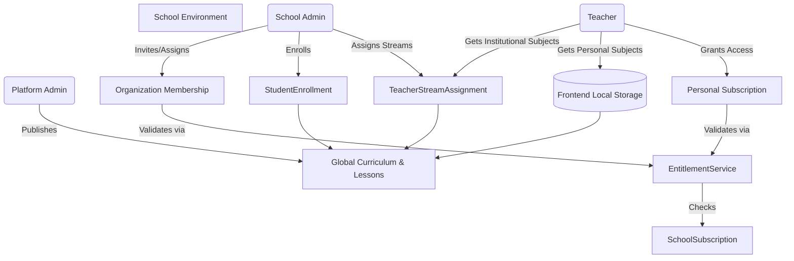

# Cross-Workspace Integration Audit Report

## 1. School Admin → Teacher Invitation
**Current State:** Working
**Data Flow Trace:**
- Admin sends invitation via `SchoolInvitationViewSet.create()`. `EntitlementService.create_school_invitation()` verifies the school has enough unused teacher seats based on `SchoolSubscription`.
- An invitation token is sent.
- Teacher clicks link, calling `InvitationAcceptAPIView.post()`.
- If successful, `OrganizationMembership` is created (or updated) to `ACCEPTED`.
- If `intended_stream` and `intended_subject` were included in the invitation, a `TeacherStreamAssignment` is automatically created, instantly granting the teacher access to the institutional class.
**Issues Found:** None.
**Architectural Recommendations:**
- Ensure the frontend properly handles token expiration and provides a resend mechanism.

## 2. School Admin → Student Enrollment
**Current State:** Working
**Data Flow Trace:**
- Admin assigns students via `StudentEnrollmentViewSet.batch_enroll()`.
- `EntitlementService.enforce_student_capacity()` validates seat count.
- An active `OrganizationMembership` with role `student` is created.
- A `StudentEnrollment` record is created.
- The student's workspace (`StudentMySchoolView`) immediately reflects the enrollment, pulling associated curriculum grades and subjects.
**Issues Found:** None.

## 3. Teacher → Student (Lesson Publishing)
**Current State:** Working
**Data Flow Trace:**
- Platform Admin (or permitted roles) publishes a lesson via `LessonViewSet.publish()`.
- The lesson status changes to `published`.
- Students access the lesson via `ActiveLessonView`, which filters lessons by `status='published'` and verifies access using `EntitlementService.check_curriculum_access()`.
**Issues Found:**
- The prompt implies teachers publish lessons to students. However, the `LessonViewSet.publish()` explicitly checks for `[IsPlatformAdmin()]`. Currently, only platform admins can publish lessons.
**Fixes Needed:**
- If teachers are supposed to publish lessons to their students, the `LessonViewSet.publish` permissions should be updated to allow teachers to publish lessons for their assigned subjects.

## 4. Subscription → Access
**Current State:** Working
**Data Flow Trace:**
- `EntitlementService` validates access in multiple places.
- Checks `school__subscriptions__is_active=True` and `school__subscriptions__end_date__gte=now`.
- If the subscription is expired, `check_curriculum_access` returns `False`, creating a hard gate for viewing curriculum.
**Issues Found:** None.
**Architectural Recommendations:**
- Implement a graceful degradation on the frontend so users clearly understand why access is blocked (e.g., "School subscription expired").

## 5. Membership → Access
**Current State:** Working
**Data Flow Trace:**
- `EntitlementService.transition_membership_state()` handles suspension (`SUSPENDED`).
- `check_curriculum_access` only grants access if `active_memberships = user.memberships.filter(state__in=['ACCEPTED', 'ACTIVE'])`.
- Once suspended, institutional access is revoked instantly.
**Issues Found:** None.

## 6. Curriculum → All Stakeholders
**Current State:** Working
**Data Flow Trace:**
- Platform admins manage curriculum (`CurriculumViewSet`, `SubjectViewSet`, etc.).
- Changes are instantly reflected for all stakeholders because access is evaluated dynamically via `EntitlementService` and foreign keys.

## 7. Teacher Personal Workspace Preservation (CRITICAL)
**Current State:** Working
**Data Flow Trace:**
- **Join School:** Institutional assignments are mapped using `TeacherSubjectAssignment` and `TeacherStreamAssignment`, both of which require a `school_id`.
- **Personal Content:** `EntitlementService` evaluates personal subscriptions completely separately from school subscriptions. If a teacher has a personal subscription, they have global curriculum access (`EntitlementService.has_full_curriculum_access`).
- **Frontend Storage:** Personal subjects are tracked entirely on the frontend via local storage (`vlearn_teacher_personal_subjects`) inside `teacherCurriculumService.js`.
- **Leave School:** If a teacher is removed from a school, their `OrganizationMembership` and `TeacherStreamAssignment` are removed/suspended. However, their personal subscription remains active, and their frontend local storage remains untouched. Thus, their personal subjects and content are perfectly preserved.
- **Multiple Schools:** The `teacherCurriculumService.getCategorizedSubjects()` fetches all streams across all schools, naturally grouping and aggregating multiple school assignments while keeping personal subjects distinct.
**Issues Found:**
- Personal subjects are only stored in `localStorage`. If a teacher logs in from a different device, their personal subjects will not sync.
**Architectural Recommendations:**
- Introduce a `PersonalSubjectBookmark` model on the backend for teachers so their personal workspace syncs across devices, independent of `school_id`.

## Integration Dependency Graph

