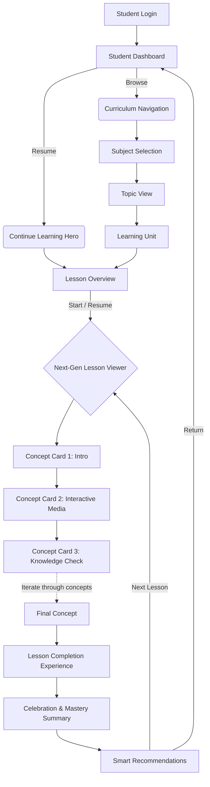

# VLearn Learning Experience (LX) Architecture Design

## Executive Summary
This document serves as the definitive architectural blueprint for the VLearn Learning Experience (LX). Designed for frontend, backend, and AI engineering teams, it outlines the end-to-end student journey from login to lesson completion. 

The core philosophy underpinning this design is **Maximize Understanding via Focused Concepts**. We fundamentally reject the "textbook on a screen" paradigm (long-scrolling text). Instead, the architecture enforces a **One Concept = One Page** learning model, where instructional content is delivered through discrete, highly interactive, and easily digestible steps.

---

## 1. Student Learning Journey

The student journey is designed to minimize friction. The goal is to move the student from the dashboard into a state of active learning in as few clicks as possible, while providing clear spatial awareness of where they are in the curriculum.

### End-to-End Flowchart

### Journey Steps Breakdown
1. **Dashboard:** The command center. Prioritizes returning the student to their most recent active lesson over browsing.
2. **Curriculum Hierarchy (Subject > Topic > Unit):** A highly visual browser providing context. Shows completion rings at each level.
3. **Lesson Overview:** A pre-flight screen. Displays learning goals, estimated time, and prerequisites before committing to the lesson.
4. **Learning Experience:** The core viewer (detailed below).
5. **Completion & Recommendations:** Closes the loop by celebrating success and immediately teeing up the next logical step in the curriculum graph.

---

## 2. Lesson Viewer Architecture

The Next-Generation Lesson Viewer is the heart of VLearn. To achieve the "One Concept = One Page" mandate, we are moving away from traditional scrolling layouts to a **Discrete Concept Card** architecture.

### Layout & Navigation Model
* **The Viewport:** A distraction-free, full-screen or focused central container. Sidebar navigation is collapsed by default.
* **Header (Spatial Context):** Contains breadcrumbs (e.g., *Biology > Cell Structure > Mitochondria*), a "Save & Exit" button, and a discrete segment-based progress bar (not a continuous line, but individual blocks representing concepts).
* **Main Stage (The Concept Card):** Renders exactly *one* concept. This space dynamically layouts Information, Visual, or Interactive components.
* **Footer (The Gatekeeper):** Contains the "Next Concept" action.

### Design Decisions: Navigation & Transitions
| Approach | Pros & Cons | Verdict |
| :--- | :--- | :--- |
| **Vertical Infinite Scroll** | **Pros:** Standard web paradigm. **Cons:** Promotes skimming. High cognitive load. Violates single-concept focus. | ❌ Rejected |
| **Story-Style Auto-Advance** | **Pros:** Engaging, mobile-native. **Cons:** Forces a pacing that may not match the student's reading/comprehension speed. | ❌ Rejected |
| **Discrete Concept Cards (Gated)** | **Pros:** Enforces focus. Allows gating (must pass mini-quiz to proceed). Low cognitive load. **Cons:** Requires explicit action to advance. | ✅ **Selected Approach** |

**Interaction Model:** 
Transitions between Concept Cards must feel instantaneous (using slide or fade micro-animations). If a card contains a Knowledge Check, the "Next Concept" button in the footer remains disabled until the student engages and answers correctly.

---

## 3. Learning Component Design System

To ensure consistency and allow the AI Content Studio to compose lessons dynamically, the frontend will implement a strict component design system. The AI generates the JSON structure; the frontend renders these specific components.

### Information Components
| Component | Purpose | Educational Value | Placement | Status |
| :--- | :--- | :--- | :--- | :--- |
| **Learning Goal** | Sets expectations. | Primes the brain for what is important. | Always Card 1. | Required |
| **Explanation** | Core text delivery. | Direct instruction. | Main content area. | Required |
| **Summary** | Bulleted recap. | Reinforcement and cognitive offloading. | End of lesson. | Required |
| **Definition** | Hoverable tooltip/card. | Clarifies jargon without breaking flow. | Inline text. | Optional |

### Visual Components
| Component | Purpose | Educational Value | Placement | Status |
| :--- | :--- | :--- | :--- | :--- |
| **Diagram** | Static structural breakdown. | Visual spatial understanding. | Alongside Explanation. | Optional |
| **Animation / GIF** | Short looping motion. | Illustrates continuous processes (e.g., mitosis). | Main content area. | Optional |
| **Video** | Deep-dive explanation. | Multi-modal learning (audio/visual). | Standalone Card. | Optional |

### Interactive Components
| Component | Purpose | Educational Value | Placement | Status |
| :--- | :--- | :--- | :--- | :--- |
| **Simulation** | Sandbox environment. | Experiential learning; discovering rules by doing. | Standalone Card. | Optional |
| **Interactive Graph** | Manipulable data. | Understanding relationships (e.g., y=mx+c). | Main content area. | Optional |
| **Expandable Illustration** | Click-to-reveal layers. | Reduces initial cognitive load. | Main content area. | Optional |

### Assessment Components
| Component | Purpose | Educational Value | Placement | Status |
| :--- | :--- | :--- | :--- | :--- |
| **Knowledge Check** | Low-stakes MCQ. | Active recall; verifies understanding before advancing. | Middle/End Cards. | Required |
| **Reflection** | Short text input. | Forces synthesis of information. | End of section. | Optional |
| **Worked Example** | Step-by-step reveal. | Scaffolds problem-solving skills. | After complex theory.| Required |

### Context Components
| Component | Purpose | Educational Value | Placement | Status |
| :--- | :--- | :--- | :--- | :--- |
| **Real World Example** | Application of theory. | Increases relevance and retention. | After Explanation. | Optional |
| **Historical Context** | Origin of the concept. | Adds narrative framing. | Intro/Side-note. | Optional |
| **Common Mistake** | Warning banner. | Pre-empts standard misconceptions. | Before Assessments. | Optional |

---

## 4. Progress Tracking Architecture

Tracking progress in a discrete-card system generates a massive volume of telemetry. The system must scale to millions of records without degrading the learning experience.

### Tracking Philosophy
Progress is not just "Lesson Complete = True". We track **granular engagement**:
* Concept Card viewed (Timestamp, Duration)
* Media played/completed
* Knowledge Check attempted (Pass/Fail, Attempts)
* Drop-off point (Exact card ID)

### Architectural Design Decision: Event-Driven Telemetry
| Approach | Architecture | Verdict |
| :--- | :--- | :--- |
| **Synchronous DB Writes** | Frontend calls API on every "Next" click. API blocks, writes to PostgreSQL, returns. | ❌ **Rejected**. High latency. Fragile on poor networks. DB bottleneck at scale. |
| **Optimistic Event Stream** | Frontend updates local state instantly. Fires asynchronous events to an API Gateway -> Message Broker (e.g., Redis Streams/Kafka) -> Async Workers write to PostgreSQL/TSDB. | ✅ **Selected Approach**. Zero UI latency. Highly scalable. |

**Resume Behavior:** When a user re-enters a lesson, the backend provides the `last_completed_concept_id`. The Lesson Viewer initializes directly on the subsequent Concept Card.

---

## 5. Lesson Completion Experience

Ending a lesson abruptly with a generic "Done" button wastes a critical psychological moment. The completion experience must build momentum.

### The "Victory Flow"
1. **The Celebration:** A brief, highly polished micro-animation (e.g., dynamic confetti, badge unlocking) that triggers immediately upon completing the final concept.
2. **Mastery Summary:** A concise, visual recap of the 3-5 key concepts the student just mastered.
3. **Curriculum Context:** An indicator showing how this lesson moved the needle (e.g., "You are now 40% through Cell Biology!").
4. **The Critical CTA (Call to Action):** The screen must intelligently suggest the *Next Recommended Lesson*. 
   * *Justification:* By teeing up the next lesson instantly, we reduce decision fatigue and increase platform session length.

---

## 6. Student Dashboard Integration

The dashboard must shift from a passive catalog to an active learning prompt.

* **The Hero Section (Continue Learning):** The largest element on the screen. It bypasses curriculum navigation and deep-links the student directly back into their active Lesson Viewer, on the exact Concept Card they left.
* **Learning Streaks:** Visual representation of consecutive days learned (gamification to drive daily active usage).
* **Curriculum Navigation:** Simplified card-based UI for subjects, showing progress rings.
* **Recommended for Revision:** An AI-driven lane that surfaces past units where the student's knowledge check scores were borderline, utilizing spaced repetition principles.

---

## 7. Scalability Strategies

To support the CBC curriculum (Form 1–4, 50+ subjects, 100,000+ lessons), the architecture relies on:

1. **Content Delivery Network (CDN) Caching:** Once published by the AI Content Studio, a lesson's JSON structure is immutable. It should be cached heavily at the edge (CDN/Cloudflare). The backend is only hit for user-specific progress tracking.
2. **Decoupled Viewer:** The frontend Lesson Viewer is purely a rendering engine. It knows nothing about the curriculum graph; it only knows how to render the standard JSON array of Concept Cards. This guarantees UI performance regardless of database size.
3. **Telemetry Aggregation:** Progress events are aggregated in-memory (e.g., Redis) before batch-writing to the relational database, preventing write-lock contention on user profile rows.

---

## 8. Future Compatibility

The architecture is deliberately designed to act as a foundation for advanced AI features without requiring a UI/UX rewrite:

* **Adaptive Learning:** Currently, the Lesson Viewer requests a static array of Concept Cards. In the future, the "Next Concept" button can query an AI Adaptive Engine that generates or selects the next Concept Card *on the fly* based on the student's recent answers. The viewer's UI remains identical.
* **AI Tutors:** The discrete Concept Card model provides perfect context. An AI Chat button can be overlaid on the viewer. Because the system knows exactly which Concept Card the student is viewing, the AI Tutor's system prompt can be automatically seeded with the exact Explanation and Knowledge Check data currently on screen, resulting in highly accurate, hallucination-free tutoring.
* **Semantic Search:** Because lessons are broken into discrete semantic blocks (Components) rather than monolithic HTML documents, future search engines can deep-link a student to the exact Concept Card containing a specific definition.
